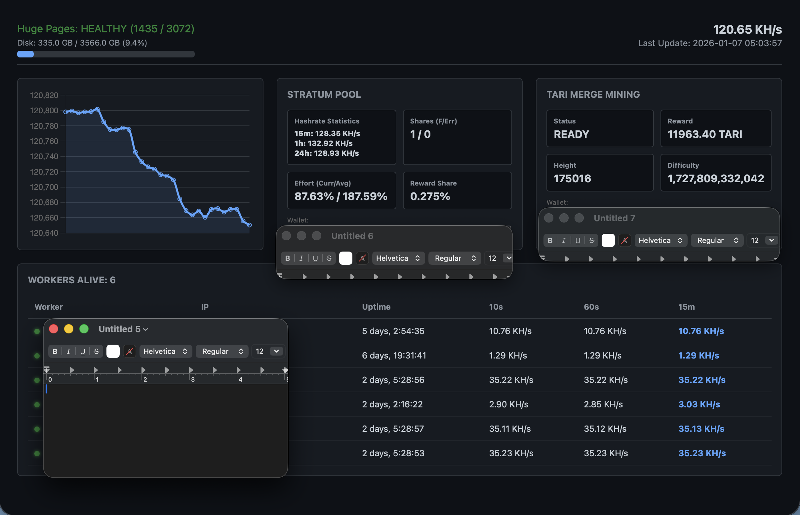

Monero + Tari Merge Mining Docker Stack
=======================================




A high-performance, containerized stack for running a private Monero full node with P2Pool and Tari merge mining. This setup includes a custom monitoring dashboard for real-time visibility into your node and worker health. By default configured to use P2Pool Mini.

⚠️ Disclaimer
-------------

**USE AT YOUR OWN RISK.** This software is provided "as is" without any warranties. Cryptocurrency mining and node operation can be resource-intensive and may expose your hardware or network to risks. Ensure you have properly configured your firewall and understand the implications of running a Tor-bridged node.


🛠️ Components
--------------

*   **Monero Node:** Full daemon with ZMQ enabled for P2Pool.
    
*   **P2Pool:** Decentralized mining pool that gives you full control.
    
*   **Tari Base Node:** Enables merge mining to earn Tari alongside XMR.
    
*   **Tor:** Anonymizes node traffic for enhanced privacy.
    
*   **Dashboard:** A custom UI monitoring hashrate, shares, and worker status.
    

🚀 Quick Setup
--------------

0. **Pre-Requisites** Install Ubuntu Server 24.04 and [Docker Engine](https://docs.docker.com/engine/install/ubuntu/). Also recommended to follow [Linux post-installation steps for Docker Engine](https://docs.docker.com/engine/install/linux-postinstall/)

Recommended to install avahi-daemon
```bash
sudo apt install avahi-daemon
```

**Ports:** No ports need to be opened. All inbound and outbound traffic for nodes and p2pool happen through tor.

1.  **Configure huge pages** Huges pages ensures your P2Pool is able to process your worker shares as fast as possible
```bash
sudo sysctl -w vm.nr_hugepages=3072

# To make these changes permanent on reboot, update grub also
sudo nano /etc/default/grub
# replace 
#   GRUB_CMDLINE_LINUX_DEFAULT="" 
# with
#   GRUB_CMDLINE_LINUX_DEFAULT="quiet splash hugepagesz=2M hugepages=3072 transparent_hugepages=never"
# ctrl-x, y to save it
sudo update-grub
sudo reboot # reboot the system
```
    
2.  **Clone and Edit:** Clone this repository and update the config.json file with your **XMR Wallet Address**, **Monero Node Username**, **Monero Node Password** and **Tari Wallet Address**. 

_Note: avoid special characters in Monero node username and password, they may conflict with os or application environments._

```bash
git clone https://github.com/VijitSingh97/p2pool-starter-stack.git
cd p2pool-starter-stack
nano config.json 
# Enter your values
# ctrl-x, y to save it
```
    
3.  **Start Tor First** 
``` bash
mkdir -p data/tor
sudo chown -R 100:101 ./data/tor
docker compose up -d tor
docker logs tor -f
# wait for message
#   Jan 09 07:31:01.000 [notice] Bootstrapped 100% (done): Done
# ctrl-c to exit
```

4. **Apply Your Config**
```bash
chmod +x configure.sh
./configure.sh
```

5. **Run P2Pool Starter Stack**
```bash
docker compose up -d

# To check monero syncing
docker logs -f monerod

# To check tari syncing from shared volume
tail -f ./data/tari/mainnet/log/base_node/base_layer.log
# To check tari syncing from inside container
docker exec -it tari tail -f /var/tari/node/mainnet/log/base_node/base_layer.log
# should show something like this when synced:
#   2026-01-12 04:32:39.503325929 [c::bn::comms_interface::inbound_handler] [,] INFO  Block #178542 (724dde31da2fe57b3f9e95fa6f13d0af5c9d92e8443fd6cda8c5acf86925e7fe) received from remote peer: 86d50f956ceb4540c779749e76 // /tari/base_layer/core/src/base_node/comms_interface/inbound_handlers.rs:894
#   2026-01-12 04:32:40.084482425 [c::cs::database] [,] INFO  Best chain is now at height: 178542 // /tari/base_layer/core/src/chain_storage/blockchain_database.rs:1819
#   2026-01-12 04:32:48.558532242 [c::bn::state_machine_service::states::listening] [,] INFO  Received a metadata update from a peer that is very far behind us. Disregarding. We are at block #178542 with an accumulated difficulty of 148779641035885625957219873406961382753761137958030855561643542440 and the network chain tip is at #29182 with an accumulated difficulty of 6525812746041971859700020032395057915398438342471264 // base_layer/core/src/base_node/state_machine_service/states/listening.rs:478
# docker logs -f tari can be used, but little messy and unclear


# To check if p2pool is running. P2pool will not run until monero is synced
docker logs -f p2pool

# check resources to see if syncing is happening is also an option
top
docker stats
```
    

📈 Monitoring
-------------

Once deployed and synced, the dashboard provides a "single pane of glass". View at: http://localhost:8000, or http://\<hostname\>.local:8000 on a computer in your local network

_To get your hostname, run the following on your machine running P2Pool Starter Stack:_
```bash
hostname
```

*   **Hashrate:** Tracks your current network contribution.
    
*   **Worker Health:** See which workers are "Alive" and their individual performance.
    
*   **Blockchain Status:** Monitor sync height and status for Tari.

💪 Workers
-------------
Recommended workers install avahi-daemon 
```bash
sudo apt install avahi-daemon
```
Xmrig workers should configure their pool section with the following:
```jsonc
"pools": [
    {
        "url": "<P2Pool Stack hostname>.local:3333",
        "user": "<worker hostname>.local",
        "pass": "x",
        "keepalive": true,
        "tls": false
    }
]
```
